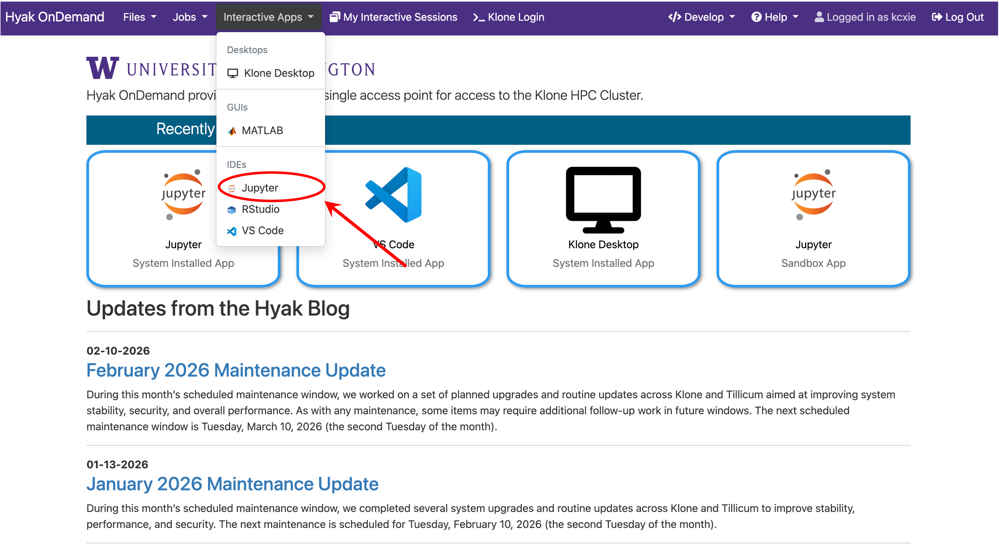
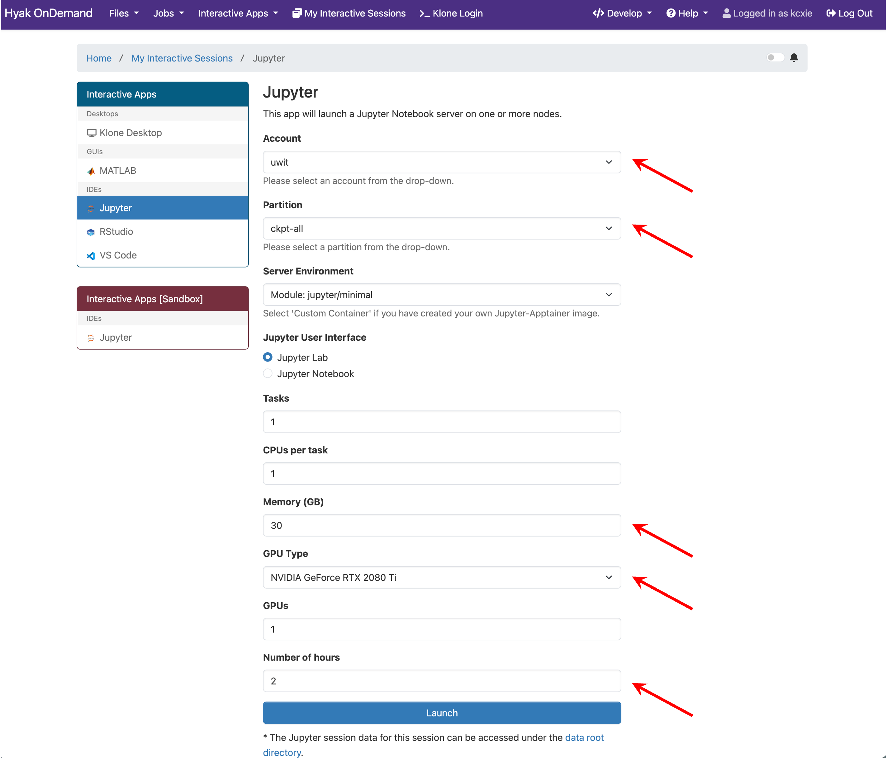
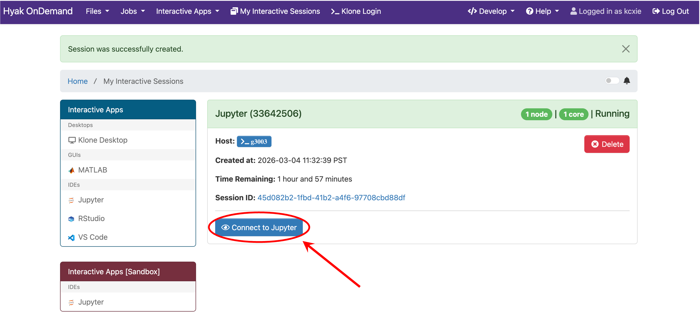
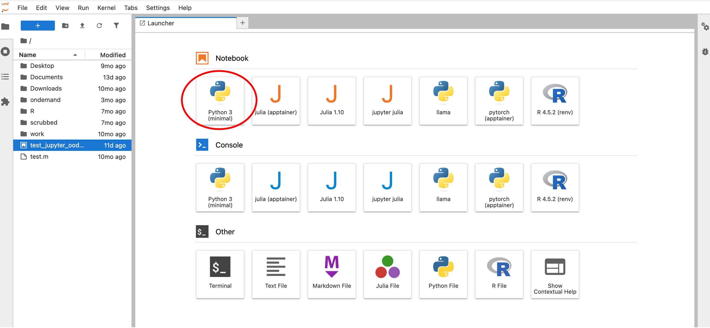
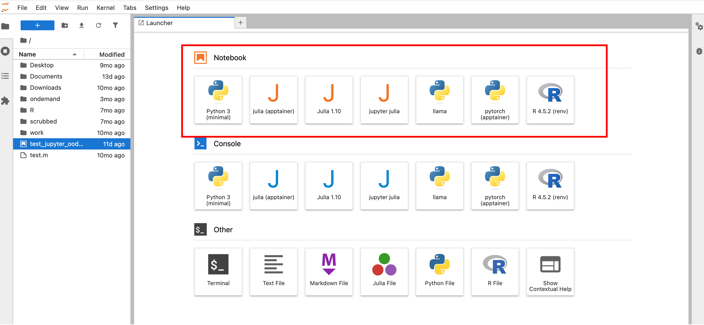
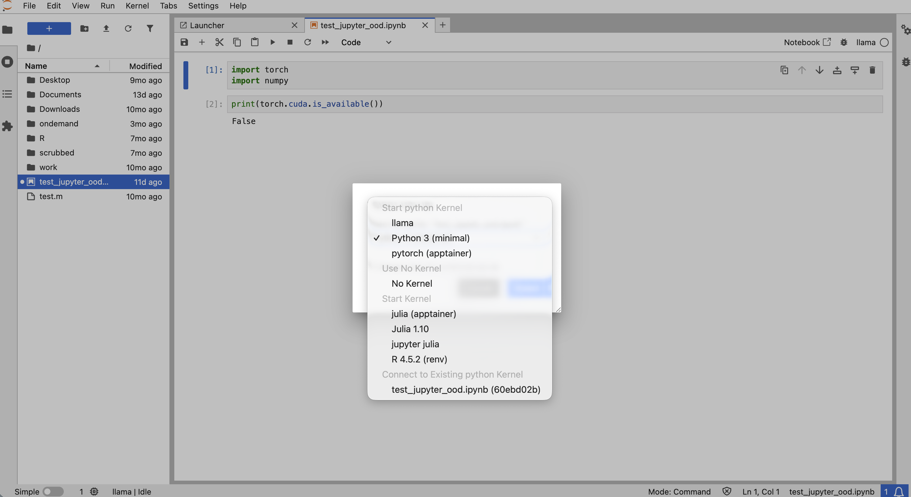
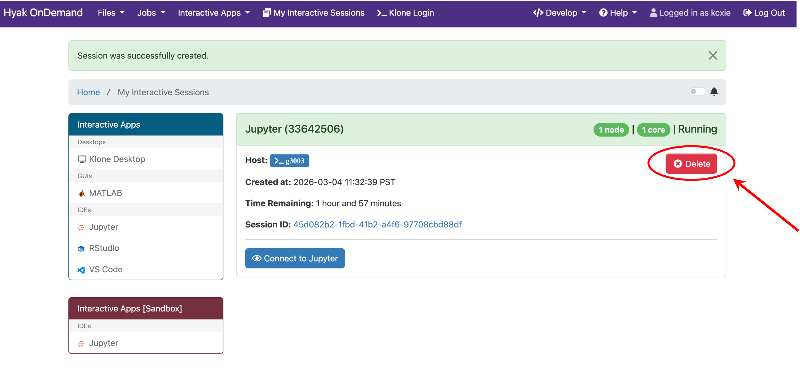

# Jupyter on Open OnDemand

Hyak Klone and Tillicum provide access to JupyterLab and Jupyter Notebook through the Open OnDemand (OOD) web portal.

🚀 [Hyak Klone OOD](https://ondemand.hyak.uw.edu/)

🚀 [Tillicum OOD](https://tillicum-ood.hyak.uw.edu/)

> 📝 **NOTE:** [UW VPN](https://uwconnect.uw.edu/it?id=kb_article_view&sysparm_article=KB0034247) is required to access OOD if you are connecting from off campus.

OOD Jupyter interface allows you to run interactive Jupyter sessions in the `$HOME` directory on compute nodes without manually submitting Slurm jobs from command line.

## What is Open OnDemand?

Open OnDemand is a web-based portal that provides an integrated, single access point for remote HPC Cluster.

It allows you to perform many common tasks without CLI, including:

- Managing files (upload, download, edit)
- Monitoring running jobs and resource usage
- Launching interactive jobs (e.g., Jupyter, RStudio, VS Code)
- Displaying remote desktop for software graphical interface (e.g., MATLAB, COMSOL)

This makes it especially convenient for workflows such as interactive data analysis and notebook-based development.

## Launch JupyterLab or Jupyter Notebook

You can run JupyterLab (recommended) or the classic Jupyter Notebook interface through OOD's Interactive Apps menu.

**Step 1: Log in to Open OnDemand**

Log in to [Hyak Klone OOD](https://ondemand.hyak.uw.edu/) using your UW NetID and Duo.

**Step 2: Navigate to the Jupyter App**

From the OOD dashboard top menu, select **Interactive Apps** > **Jupyter**. 


*Screenshot showing the OOD dashboard. The arrow indicates the Interactive Apps menu and shows the Jupyter application.*

**Step 2: Configure the Interactive Job**

You will be prompted to configure the resources for your Jupyter session.


*Screenshot showing the Jupyter launch form. Arrows indicate the account, partition, memory, GPU type, and number of hours fields.*

For this tutorial, configure the form as follows:

- **Account**: uwit (if available)
- **Partition**: ckpt-all (community checkpoint resources; queue time may vary)
- **Server Environment**: "Module: jupyter/minimal"
> 📝 **NOTE:** The environments listed in the form are maintained by the Hyak team.
- **Jupyter User Interface**: JupyterLab (recommended). If you prefer the classic interface, select “Jupyter Notebook” instead.

The following fields of the form set up the resources requested for your job:

- **Tasks** to 1
- **CPUs per tasks** to 1
- **Memory (GB)** to 30
- **Number of hours** to 2

Optional GPU settings if your workflow requires GPUs:

- **GPU Type** to **NVIDIA GeForce 2080 Ti** or **NVIDIA Quadro RTX 6000**
- **GPUs** to 1

Finally, click the **Launch** button.

**Step 3: Wait for Job Allocation**

After submission, OOD will:

1. Submit a Slurm interactive job under your account.
2. Wait for resources to become available.
3. When ready, show a **Connect to Jupyter** button.

The session page will display:

- Slurm Job ID – the scheduler identifier (the number in the parentheses).
- Host – the compute node running your job.
- Status – changes to Running when ready
- Session ID – links to detailed logs for troubleshooting.

Click **Connect to Jupyter** once the job is running. A new browser tab will open with your live Jupyter environment running on a compute node.


*Screenshot showing your OOD job queue. The job will be ready when the status changes to "Running" and the button to "Connect to Jupyter" is visible.*

## Use Conda Environments as Jupyter Kernels

By default, Jupyter uses the system Python kernel provided by the jupyter/minimal Python environment.


*Screenshot showing the Launcher tab after connecting to JupyterLab. The circle indicates the Jupyter kernel from the preinstalled minimal Python environment.*

You can also use your own Conda environments as Jupyter kernels.

**Step 1: Load Conda and Activate Your Environment**

If you already have a conda environment you want to use as a Jupyter kernel, **make sure it includes the IPython kernel package `ipykernel`**. Otherwise, create a new Conda environment with the packages you want plus `ipykernel`.

From a terminal (SSH or OOD "Klone Login" shell), run:

```bash
module load conda
conda activate myenv
conda install ipykernel
```

**Step 2: Register Your Environment as a Kernel**

Run `ipykernel install` in your activated environment to set up a Jupyter [`kernelspec`](https://jupyter-client.readthedocs.io/en/latest/kernels.html).

```bash
python -m ipykernel install --user --name myenv --display-name "Python (myenv)"
```

Explanation:

- `--name`: internal environment name
- `--display-name`: name shown in JupyterLab

This creates a `kernelspec` file `$HOME/.local/share/jupyter/kernels/myenv/kernel.json`, which registers your environment as a Jupyter kernel visible in Jupyter notebook. Any packages installed in your Conda environment will be available to you.

> 💡 **TIP:** Containers can also be registered as Jupyter kernels.

Example `kernel.json` file:

```json
{
 "argv": [
  "/mmfs1/gscratch/scrubbed/<user>/conda/envs/myenv/bin/python",
  "-m",
  "ipykernel_launcher",
  "-f",
  "{connection_file}"
 ],
 "display_name": ”Python (myenv)",
 "language": "python",
 "metadata": {
  "debugger": true
 }
}
```

Key fields:

- argv: Command line arguments to start the kernel
- display_name: Name shown in the Jupyter interface
- language: Programming language (e.g., Python, R, or Julia) used by the kernel
- env (optional): environment variables to set for the kernel
- metadata (optional): Additional attributes about this kernel

You can list installed kernels with:

```bash
jupyter kernelspec list
```

**Optional: Use Containers as Jupyter Kernels**

Containers can also be registered as Jupyter kernels, which allows you to run notebooks inside a containerized environment.

To register a container as a Jupyter kernel, start with a basic `kernelspec` and prepend argv with the container runtime command (e.g. `apptainer`) and options.

Create a `kernel.json` file similar to the example below and put it at `$HOME/.local/share/jupyter/kernels/<name>/kernel.json`.

Example `kernel.json` file:

```json
{
 "argv": [
  "apptainer",
  "exec",
  "--cleanenv",
  "--bind", "/gscratch",
  "</path/to/your/container/image>/<image_name>.sif",
  "</path/to/your/image/python>",
  "-m",
  "ipykernel_launcher",
  "-f",
  "{connection_file}"
 ],
 "display_name": "Python (My Environment)",
 "language": "python",
 "metadata": {
  "debugger": true
 }
}
```

Update the following fields as needed:

- Container image name and path (e.g., /gscratch/.../*.sif)
- Python interpreter path inside the container
- display_name, which determines how the kernel appears in Jupyter.

Once registered, this kernel will appear alongside other Python environments in the Jupyter Launcher and Kernel selection menus.

**Step 3: Launch A Jupyter Notebook**

In the **Launcher** tab of your JupyterLab session, select your custom kernel under the **Notebook** section.


*Screenshot showing the Launcher tab. A squre box indicates all avaiable kernels under the Notebook section.*

Your notebook will now run inside your custom Conda environment.

**Step 4: Switch Kernels**

Inside a notebook, from the JupyterLab top menu select **Kernel** > **Change Kernel** to switch kernels in the dropdown box.


*Screenshot showing the dropdown box for switching kernels in a Jupyter notebook.*

> 💡 **TIP:** If your new kernel does not appear, restart your Jupyter session after running the `ipykernel install` command.

## Close the Session

When you finish:

1. Save your work and close the Jupyter browser tab.
2. Return to OOD **My Interactive Sessions** dashboard and click **Delete** on your running session card.

The compute resources will be released back to the cluster.

> ⚠️ **WARNING:** For Tillicum, leaving sessions running consumes GPU hours and counts toward your project usage.


*Screenshot showing your OOD job queue. The arrow indicates the button to close the session.*