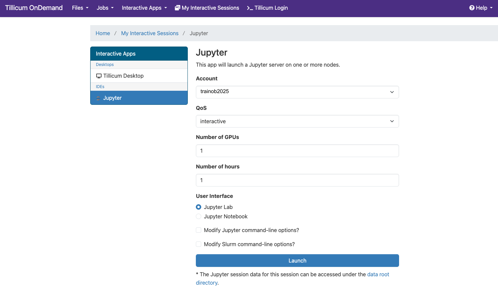
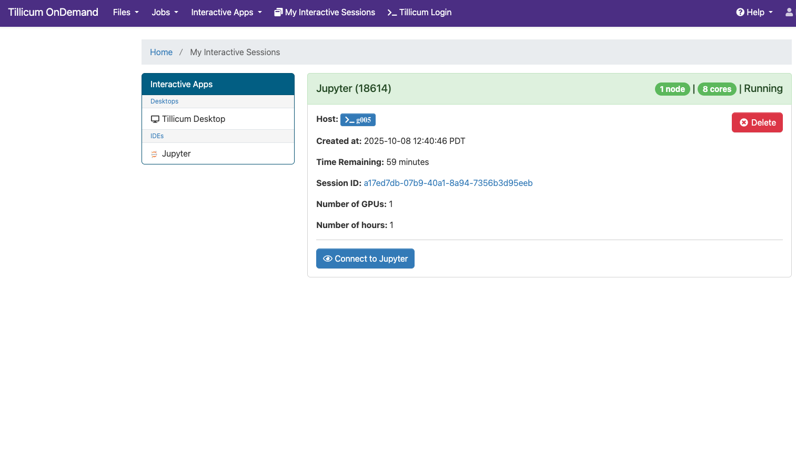
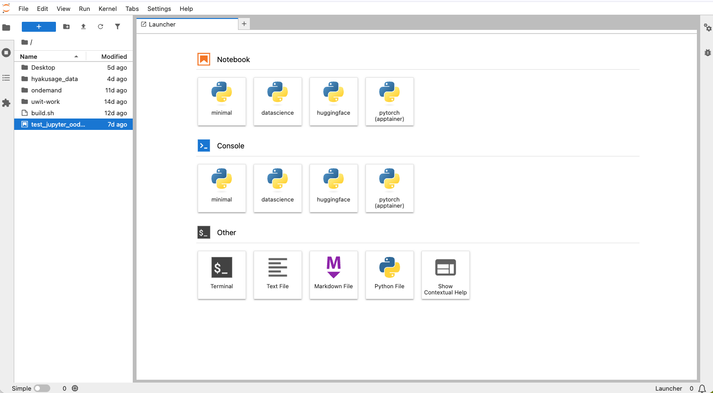
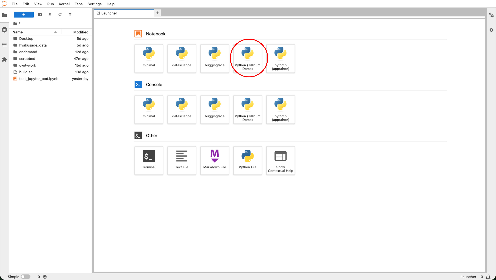
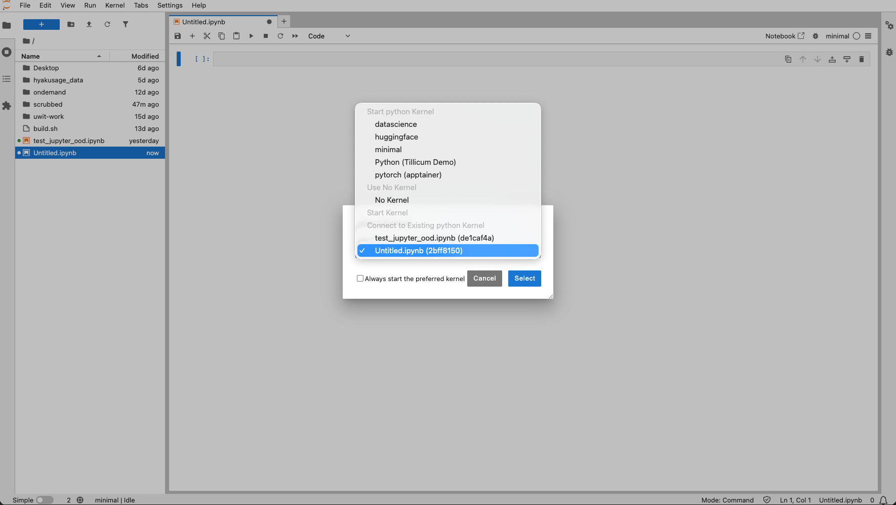

# Jupyter on Open OnDemand

Tillicum provides JupyterLab and Jupyter Notebook access through [Open OnDemand (OOD)](https://tillicum-ood.hyak.uw.edu/).

> 📝 **NOTE:** UW VPN is required to access OOD if you are off-campus.

This interface allows you to run interactive Jupyter sessions in the `$Home` directory on compute nodes without manually submitting Slurm jobs.

## Open OnDemand

Open OnDemand is a web-based portal that provides an integrated, single access point for remote HPC Cluster.

It enables you to perform many common tasks without CLI, including:

- Managing files (upload, download, edit)
- Monitoring running jobs and resource usage
- Launching interactive jobs (e.g., Jupyter, RStudio, VS Code)
- Displaying remote desktop for software graphical interface (e.g., MATLAB, COMSOL)

## Launch JupyterLab or Jupyter Notebook

You can run JupyterLab (recommended) or the classic Jupyter Notebook interface through OOD's Interactive Apps menu.

**Step 1: Navigate to the Jupyter App**

From the OOD dashboard, select **Interactive Apps** > **Jupyter**. 

The default interface is JupyterLab.
If you prefer the classic interface, choose “Jupyter Notebook” instead.

**Step 2: Launch An Interactive Job**

You will be prompted to enter information about the job you want to run.



Once you've filled out the form, click **Launch**.

**Step 3: Wait for Allocation**

After submission, OOD will:

1. Submit a Slurm interactive job under your account.
2.	Wait for resources to become available.
3.	When ready, show a Connect to Jupyter button.

Click **Connect to Jupyter** once it appears. A new browser tab will open with your live Jupyter environment running on a Tillicum compute node.



## Use Conda Environments as Python Kernels

By default, Jupyter uses the system's Python kernel provided by a minimal Python environment. There are also several prebuilt Python kernels with more packages installed.



You can also use your own Conda environments as custom Python kernels.

**Step 1: Load Conda and Activate Your Environment**

If you already have a conda environment you want to use as a Jupyter kernel, make sure it includes the IPython kernel package `ipykernel`. Otherwise, create a new Conda environment with the packages you want plus `ipykernel`.

From a terminal (either SSH or OOD's "Tillicum Login"), run:

```bash
module load conda
conda activate myenv
conda install ipykernel
```

**Step 2: Register Your Environment as a Jupyter Kernel**

Run `ipykernel install` in your activated environment to set up a Jupyter [kernelspec](https://jupyter-client.readthedocs.io/en/latest/kernels.html).

```bash
python -m ipykernel install --user --name myenv --display-name "Python (myenv)"
```

This creates a Jupyter kernel entry visible in Jupyter notebook. Any packages installed in your Conda environment will automatically be available to you. Please note:

- `--name`: internal environment name
- `--display-name`: name shown in JupyterLab

> 💡 **TIP:** Containers can also be registered as Jupyter kernels.

**Step 3: Launch A Jupyter Notebook**

Once JupyterLab opens, in the **Launcher** tab, under **Notebook** choose **Python (myenv)**.



Your notebook will now run inside your custom Conda environment.

**Step 4: Switch the Kernel**

Inside a notebook, go to **Kernel** > **Change Kernel** to switch kernels in the dropdown box.



> 💡 **TIP:** If your custom kernel doesn't appear, restart the Jupyter session after running the `ipykernel install` command.

## Close the Session

When you finish:

1. Save your work and close the Jupyter browser tab.
2. Return to OOD and click **Delete** on your running session card.
3. The compute resources will be released back to the cluster.

> ⚠️ **WARNING:** Leaving sessions running consumes GPU hours and counts toward your project usage.